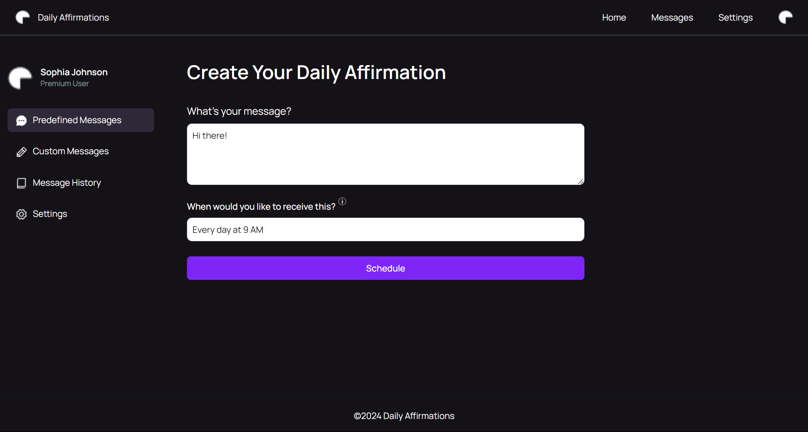
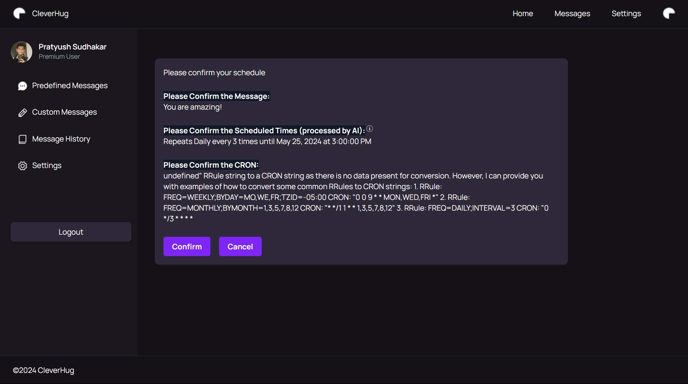
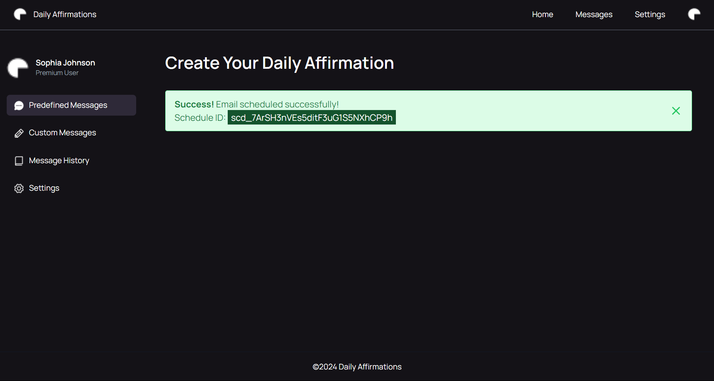

<!-- ⚠️ This README has been generated from the file(s) "blueprint.md" ⚠️-->
[](#cleverhug-email-sceduler)

# ➤ CleverHug Email Sceduler


[](#description)

## ➤ Description

This is a simple python script that sends CleverHug to a specified email address at a specified time. The affirmations are stored in a text file and are sent in the body of the email. It uses `rrule` format to schedule the emails and `UpStash/QStash` to schedule the emails.


[](#architecture)

## ➤ Architecture

### Frontend

The frontend is built using `React.js` `Typescript` and `pnpm` and is hosted on Vercel.

### Backend

The backend is built using `Flask` and is hosted on `Vercel` as well.
The backend uses a variation of the `recurrent` library to parse the `rrule` format from the user's input and schedule the emails accordingly.


[](#installation)

## ➤ Installation

1. Clone the repository

   ```bash
   git clone
   ```

### Frontend

1. Navigate to the `frontend` directory

   ```bash
   cd frontend
   ```

2. Set the environment variables

   ```bash
   cp .env.local
   ```

3. Install the dependencies

   ```bash
    pnpm install
   ```

4. Start the development server
   ```bash
   pnpm start
   ```

The frontend should now be running on `http://localhost:3000`

### Backend

1. Navigate to the `backend` directory

   ```bash
   cd backend

   ```

2. Set the environment variables

   ```bash
   cp .env
   ```

3. Install the dependencies

   ```bash
    pip install -r requirements.txt
   ```

4. Start the development server
   ```bash
    python server.py
   ```

The backend should now be running on `http://localhost:3001`


[](#screenshots)

## ➤ Screenshots

- Home Page
  

- Processed Time
  

- CleverHug Scheduled
  
