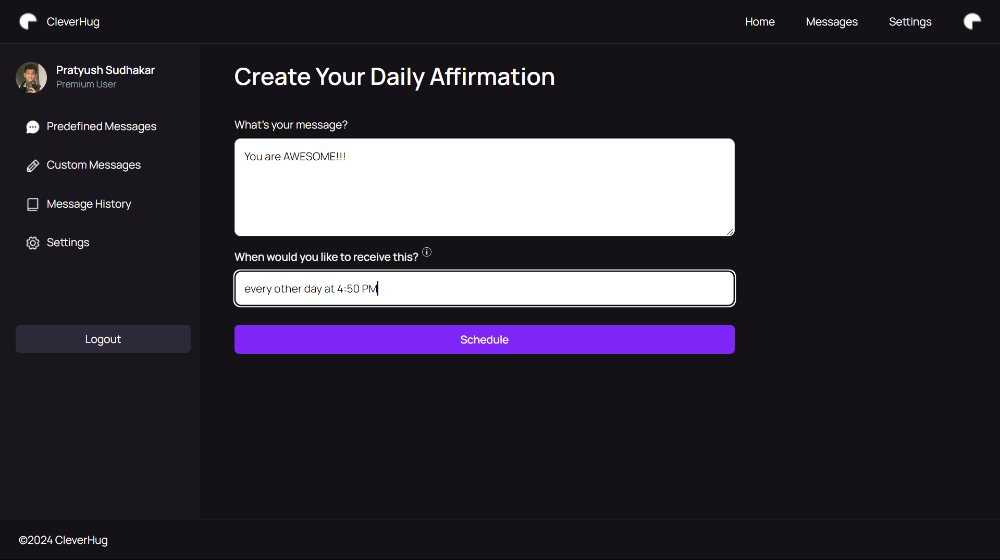

<!-- ⚠️ This README has been generated from the file(s) "blueprint.md" ⚠️-->

[](#cleverhug-email-sceduler)

# ➤ CleverHug Email Sceduler

[](#description)

## ➤ Description

CleverHug is an email scheduler that allows users to schedule emails to be sent to themselves at a later time. The emails can be scheduled to be sent at a specific time or at a recurring time. The user can also view the emails that have been scheduled and the time at which they were processed.

[](#features)

## ➤ Features

1. **Schedule Emails**: Users can schedule emails to be sent to themselves at a later time.
2. **Recurring Emails**: Users can schedule emails to be sent to themselves at a recurring time.
3. **View Scheduled Emails**: Users can view the emails that have been scheduled.
4. **View Processed Time**: Users can view the time at which the emails were processed.
5. **Responsive and Easy to use Interface**: Users can easily set schedules with just one line of input.

[](#architecture)

## ➤ Architecture

Checkout [`TECHNNICAL.md`](./TECHNICAL.md) for an indepth understanding of the architecutre and the modules used.

### Frontend

The frontend is built using `React.js` `Typescript` and `pnpm` and is hosted on Vercel.

### Backend

The backend is built using `Flask` and is hosted on `Vercel` as well.
The backend uses a variation of the `recurrent` library to parse the `rrule` format from the user's input and schedule the emails accordingly.

[](#installation)

## ➤ Installation

1. Clone the repository

   ```bash
   git clone
   ```

### Frontend

1. Navigate to the `frontend` directory

   ```bash
   cd frontend
   ```

2. Set the environment variables

   ```bash
   cp .env.local
   ```

3. Install the dependencies

   ```bash
    pnpm install
   ```

4. Start the development server
   ```bash
   pnpm start
   ```

The frontend should now be running on `http://localhost:3000`

### Backend

1. Navigate to the `backend` directory

   ```bash
   cd backend

   ```

2. Set the environment variables

   ```bash
   cp .env
   ```

3. Install the dependencies

   ```bash
    pip install -r requirements.txt
   ```

4. Start the development server
   ```bash
    python server.py
   ```

The backend should now be running on `http://localhost:3001`

[](#screenshots)

## ➤ Screenshots

### Landing Page & Login Page

|  |  |
| :----------------------------------------: | :------------------------------------: |
|              **Landing Page**              |             **Login Page**             |

### Dashboard & Processed Time

|  |  |
| :--------------------------------------------: | :-------------------------------------------------: |
|               **Dashboard Time**               |                 **Processed Time**                  |

### CleverHug Scheduled


